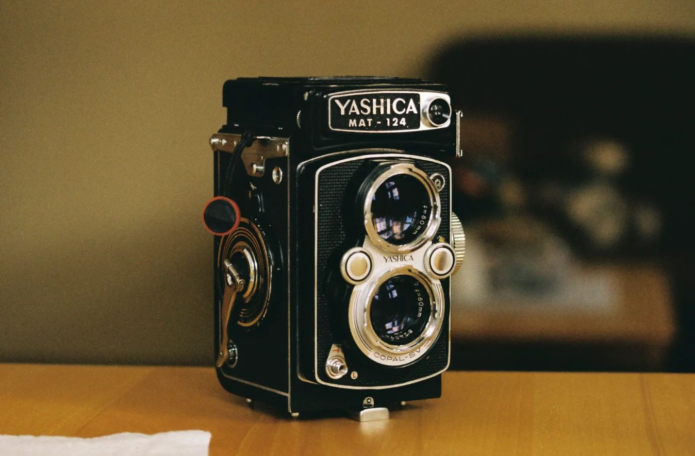

# computation_3_final_project

## My project
I want to propose a digital camera with a waist-level viewfinder using a rasepberry pi 5 and camera module. This is inspired by the Yashica Yashicaflex:

  

