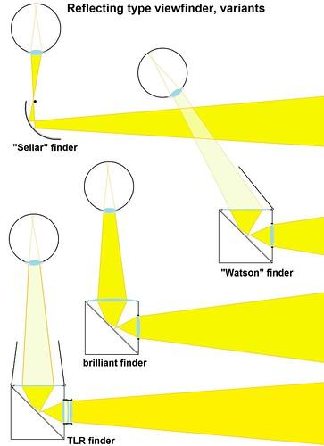

# computation_3_final_project

## My project
I want to propose a **digital camera** with a waist-level viewfinder using a rasepberry pi 5 and camera module.
This is inspired by the ***Yashica Yashicaflex***:

  

## Data 
***What***
I will be of course taking photos as my data, with hopefully the time it was taken location. 
(I might be able to use my phones hotspot as a wifi source to connect to the cloud when uploading photos) 
Then once they are on a website I could edit them like applying filters and transforming the photos, kind of like adobe lightroom (but my version) 
***Why***
The reason I want to make a camera specificlly is I’m interested in the challenge of the hardware along side the software
Also I wanted to make my own waist-level camera because it seems like a really cool and novel thing, although I am not too sure yet if I have the time to make it reflective see the image: 

  

## Hardware
 - **Raseberry Pi 5** 
 - **Raseberry Pi Camera Module 3**
 -  **0.91 Inch I2C OLED Display Module IIC**
 -  **Pisugar2 Plus Portable Module Platform ( Battery )**
 -  **Custom 3d printed case**
 -  **Buttons / Potentiometer**

## Maybe ??
  - Instead of a regular camera us an ai camera module so I can detect people and object and categorize them 
  - If I cannot get the lense working I will switch to a screen on the top
  - Make the website open so anyone can come in and edit the photos and the result stay
